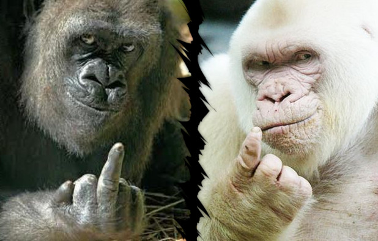
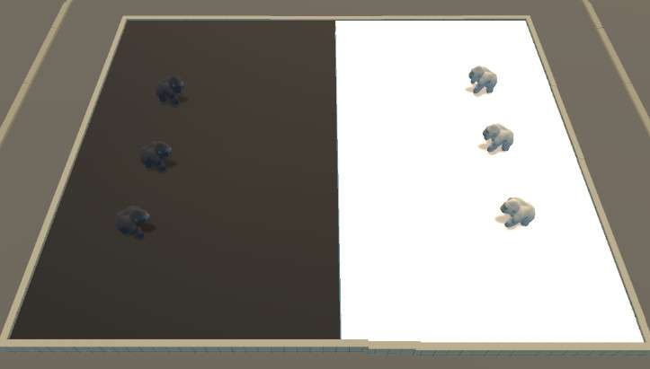
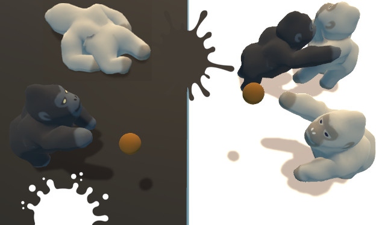
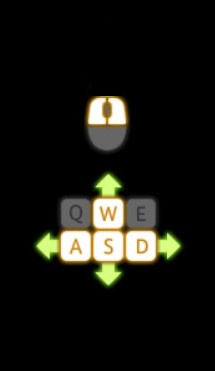

# ウルトラゴリラ VS デスゴリラ 企画書のようなもの

---

---
## 概要
ウルトラゴリラ陣営（チームカラー：黒）とデスゴリラ陣営（チームカラー：白）に分かれて戦う、少人数対戦の陣取りゲームです。制限時間内にチームカラーを地面上に多く塗れたチームの勝利となります。

---

---
## 攻撃
ゴリラは2種類の攻撃が可能です。攻撃するごとにスタミナを消費し、スタミナが尽きると攻撃ができなくなります。スタミナは時間経過で回復します。
- 殴る
相手ゴリラに当てるとダメージを与えます。
- 物体を投げる
地面に当たった場合は、チームカラーを着色します。
ゴリラに当たった場合は、着色できません。

---
## ダメージ
相手から殴られた場合、ゴリラの体力（ゴリライフ）が削られます。ゴリライフがゼロになるとノックアウト状態になります。ノックアウトされたゴリラは、復帰まで数秒待機します。復帰したゴリラは数秒の無敵時間を伴って初期位置にリスポーンします。

---

## 操作方法

- マウス
左クリック/近接攻撃
右クリック/物体を投げる

- キーボード
W/A/S/Dで移動